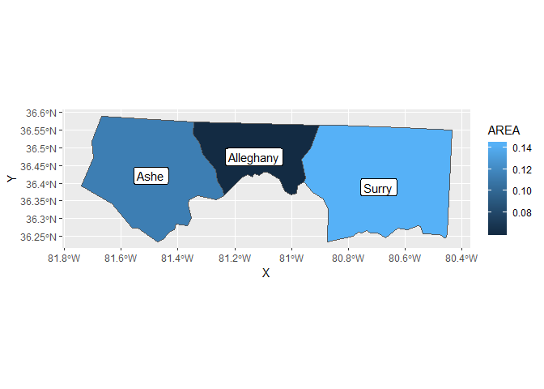
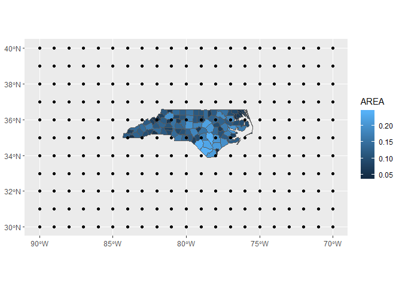
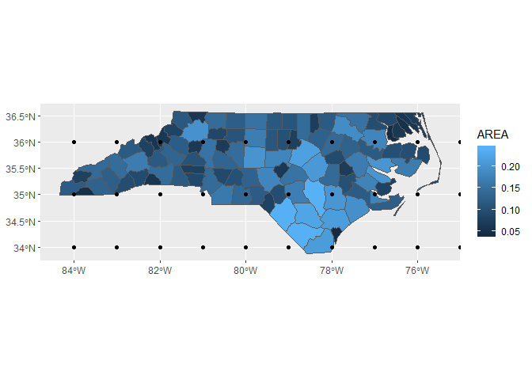

<!-- README.md is generated from README.Rmd. Please edit that file -->
ggsflabel
=========

[](https://travis-ci.org/yutannihilation/ggsflabel)

Provides several `geom`s which plot labels generated from `sf` data.

Installation
------------

ggsflabel is not released on CRAN yet. Please install with `install_github()`.

``` r
# install.packages("devtools")
devtools::install_github("yutannihilation/ggsflabel")
```

Example
-------

### `geom_label()` for sf

``` r
library(ggsflabel)
#> Loading required package: ggplot2

nc <- sf::st_read(system.file("shape/nc.shp", package = "sf"), quiet = TRUE)

ggplot(head(nc, 3)) +
  geom_sf(aes(fill = AREA)) +
  geom_sf_label(aes(label = NAME))
#> Warning in st_point_on_surface.sfc(data$geometry): st_point_on_surface may
#> not give correct results for longitude/latitude data
```



### `geom_label_repel()` for sf

``` r
if (requireNamespace("gghighlight", quietly = TRUE)) {
  library(gghighlight)
  
  ggplot(nc) +
    geom_sf(aes(fill = AREA)) +
    gghighlight(AREA > 0.20) +
    geom_sf_label_repel(aes(label = NAME),
                        force = 100, nudge_x = -2, seed = 10) +
    scale_y_continuous(expand = expand_scale(mult = 0.5))
}
#> Warning in st_point_on_surface.sfc(data$geometry): st_point_on_surface may
#> not give correct results for longitude/latitude data
```


### `lims()` for sf

``` r
points_sfg <- sf::st_multipoint(as.matrix(expand.grid(x = -90:-70, y = 30:40)))
points_sfc <- sf::st_sfc(points_sfg, crs = sf::st_crs(nc))

p <- ggplot() +
  geom_sf(data = nc, aes(fill = AREA)) +
  geom_sf(data = points_sfc)

# too wide
p
```



``` r

# shrink the limits to the bbox of nc
p + lims_bbox(nc)
```


